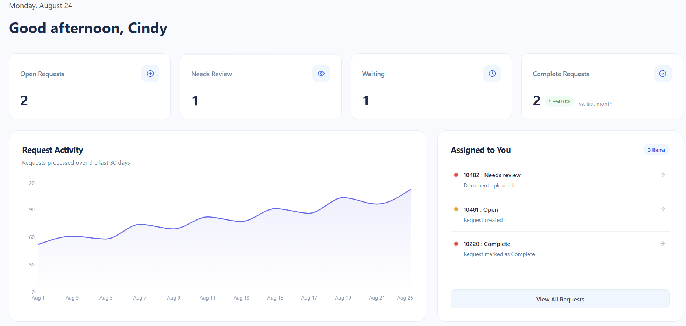
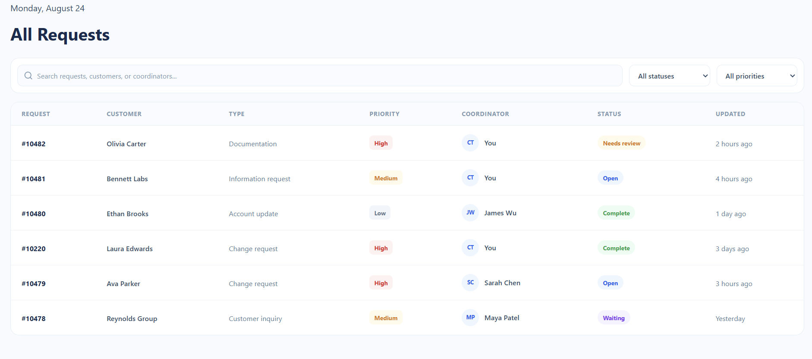
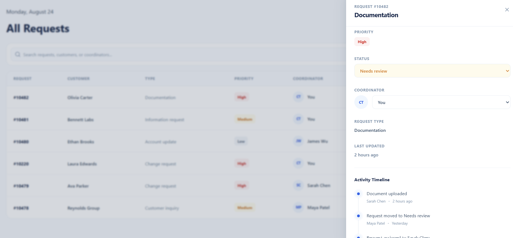

# Mock Workflow Management Dashboard

A responsive front-end workflow management dashboard built with Vite + Reac to demonstrate data-driven designs and state management (using React state). The application allows users to view, search, filter, and manage requests through n interactive interface.

## Project Features

1. Dashboard home page: provides a quick snapshot/summary of monthly requests. 

    - Note:  KPI Cards and listed requests in the Attention panel are clickable, routing user to Requests page with preselected filters or preselected drawer (done with URL query parameters).
2. Requests page: displays table of all requests.

    - Note: Activity timeline within a request detail drawer updates with *Status* and *Priority* changes.

## Possible future improvements
- Additional filters for Requests table
- Add Request creation/editing
- Pagination

